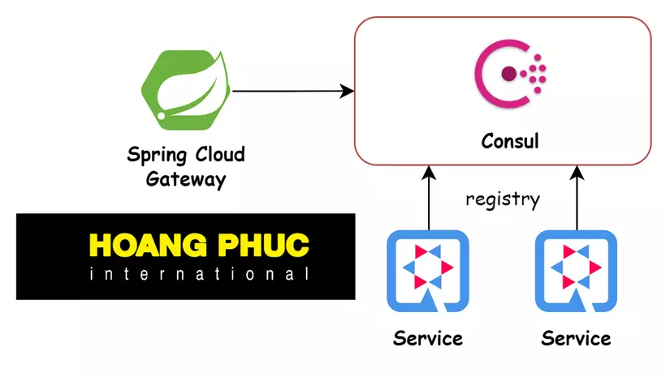

# stocat-gateway — Consul Service Discovery + Spring Cloud Gateway

Consul 기반 서비스 디스커버리와 Spring Cloud Gateway(WebFlux)로 구성된 경량 API 게이트웨이
`gateway`는 Consul에 등록된 서비스 목록을 읽어 동적으로 라우트를 생성하고, `services` 하위의 샘플 서비스들이 Consul에 자체 등록됩니다.

- Gateway: Spring Cloud Gateway(Server WebFlux)
- Service Registry: HashiCorp Consul (Docker Compose로 Dev 모드 실행)
- Sample Services: `demo-catalog`(8081), `demo-order`(8082)
- Java 21, Spring Boot 3.5, Spring Cloud 2025.0

## 아키텍처



간단히 말해 각 서비스는 기동 시 Consul에 등록되고(헬스체크 포함), Gateway는 Consul Discovery를 통해 서비스 목록을 구독하여 라우트를 동적으로 생성합니다. 기본 설정에서는 서비스 ID 기준으로 `/{serviceId}/**` 패턴의 라우트가 만들어집니다.

참고: 기본 라우트는 서비스 ID 접두어가 그대로 백엔드로 전달.
백엔드가 접두어 없이 경로를 받길 원한다면 `StripPrefix=1` 같은 기본 필터를 Discovery Locator에 추가 필요.

## 실행 방법(Quick Start)
1) Consul 띄우기
- `docker-compose up -d`
- UI: http://localhost:8500 (Services 탭에서 등록 상태 확인)

2) 서비스 기동(각 터미널에서)
- `./gradlew :services:demo-catalog:bootRun`
- `./gradlew :services:demo-order:bootRun`

3) 게이트웨이 기동
- `./gradlew :gateway:bootRun`

4) 동작 확인
- 서비스 직접 헬스체크
  - `curl http://localhost:8081/actuator/health`
  - `curl http://localhost:8082/actuator/health`
- 게이트웨이 라우팅(접두어 포함)
  - 기본값으로는 `/demo-catalog/**`, `/demo-order/**` 경로가 생성.

    (해당 프로젝트는 별도로 라우팅 관리를 하여 `/catalog/**`, `/order/**` 로 라우팅)
  - 백엔드가 접두어를 기대하지 않는 경우 Discovery Locator에 `StripPrefix` 필터를 추가.

## 주요 설정 포인트
- Consul Dev 모드: `docker-compose.yml`에서 `hashicorp/consul:1.21.1`를 Dev 모드로 실행합니다.
- 서비스 등록과 헬스체크
  - 각 서비스 `application.yml`
    - `spring.cloud.consul.discovery.register=true`
    - `health-check-path=/actuator/health` 및 `health-check-interval=10s`
- 게이트웨이 라우팅/설정(Consul KV 기반)
  - `gateway/build.gradle`: `spring-cloud-starter-consul-config` 사용
  - `gateway/src/main/resources/application.yml`
    - `spring.config.import=optional:consul:`
    - `spring.cloud.consul.config.format=FILES` 로 전환해, 폴더 단위로 여러 파일을 로드
    - `watch.enabled=true`
    - Discovery Locator는 비활성화(`enabled=false`)하고, 라우트는 Consul KV에서 관리

필요 시 Discovery Locator에 기본 필터를 부여하여 경로 접두어 제거 등 공통 처리를 적용할 수 있습니다(예: `StripPrefix=1`).

### JWT → Downstream 헤더 전파
- 게이트웨이는 리소스 서버로서 JWT를 검증하고, 인증된 요청의 JWT에서 사용자 식별자를 추출하여 백엔드로 전달합니다.
- 추출 규칙: `userId` 클레임이 있으면 사용, 없으면 `sub`(subject)를 사용합니다. 둘 다 없거나 인증이 없으면 빈 문자열을 전달합니다.
- 전달 헤더: `X-User-Id`
- 구현: `gateway/src/main/java/com/stocat/gateway/filter/UserIdHeaderFilter.java`
- 필요 시 헤더 이름/클레임 키를 환경설정으로 바꾸고 싶다면 요청해 주세요.

### Consul에서 JWT Secret 공용 키로 관리(코드 직접 조회)
- 게이트웨이는 Consul 클라이언트로 시크릿을 직접 조회합니다.
- 공용 키 경로(단일): `config/common/secrets/jwt-secret` (raw 문자열)
- 경로를 바꾸고 싶다면 단일 설정 키 `jwt.secret.key`로만 변경 가능합니다.

등록 예시(curl):
```bash
# 공용 경로에 저장
curl --request PUT --data-binary "replace-with-a-strong-secret-32-bytes-min" \
  http://localhost:8500/v1/kv/config/common/secrets/jwt-secret
```

주의사항
- 로컬 기본값은 없습니다. Consul에서 키를 읽지 못하면 기동 실패(`fail-fast: true`).
- 애플리케이션 이름(`spring.application.name=gateway`)과 prefix(`config`)를 변경하면 키 경로도 함께 조정해야 합니다.
- 여러 프로젝트에서 공유하려면 공용 경로(`config/common/secrets/jwt-secret`)만 관리하고, 각 애플리케이션에서는 별도 설정 없이 그대로 사용하면 됩니다. 필요 시 환경변수 `JWT_SECRET_KEY`로 공용 경로를 프로젝트 표준에 맞게 변경할 수 있습니다.

자동 반영(Watch/Refresh)
- Consul KV를 주기적으로 폴링하여 변경을 감지하고 자동으로 리프레시합니다.
- 구성
  - `@RefreshScope`가 적용된 `jwtDecoder` 빈
  - `ConsulJwtSecretWatcher`가 KV 변경을 감지하면 `ContextRefresher.refresh()` 호출
  - 스케줄: `jwt.secret.watch-interval`(기본 5000ms)
- 별도 `/actuator/refresh` 호출이 필요 없습니다(자동 반영).

## 폴더 구조
- `gateway/` — Spring Cloud Gateway 모듈
- `services/demo-catalog/`, `services/demo-order/` — 샘플 서비스 모듈
- `docker-compose.yml` — 로컬 Consul 실행 정의


## 왜 Consul인가
- 단순하고 견고한 서비스 레지스트리/키밸류 스토어
- Health 체크/세션 TTL 기반 등록 상태 관리
- 멀티런타임/멀티플랫폼 환경에서의 호환성

## 관련 파일
- `gateway/build.gradle` — Consul Discovery, Gateway(WebFlux) 의존성
- `gateway/src/main/resources/application.yml` — Discovery Locator 설정
- `services/*/src/main/resources/application.yml` — 서비스 등록/헬스체크 설정
- `docker-compose.yml` — Consul Dev 모드 실행

---

## Consul KV로 라우팅 관리하기
게이트웨이를 재배포하지 않고 라우트를 바꾸려면 Consul KV에서 라우트 구성을 변경하면 됨.

- 키 경로: `config/gateway/routes.yaml` (data-key는 `routes.yaml`)
- 값 포맷: YAML (`spring.cloud.consul.config.format=YAML`)

예시 값(Consul KV에 저장)
```yaml
spring:
  cloud:
    gateway:
      server:
        webflux:
          discovery:
            locator:
              enabled: false
          routes:
            - id: catalog
              uri: lb://demo-catalog
              predicates:
                - Path=/catalog/**
              filters:
                - StripPrefix=1

            - id: order
              uri: lb://demo-order
              predicates:
                - Path=/order/**
              filters:
                - StripPrefix=1
```

KV 등록 방법(예: 로컬 Consul):
```bash
cat <<'YAML' | curl --request PUT --data-binary @- \
  http://localhost:8500/v1/kv/config/gateway/routes.yaml
spring:
  cloud:
    gateway:
      server:
        webflux:
          discovery:
            locator:
              enabled: false
          routes:
            - id: catalog
              uri: lb://demo-catalog
              predicates:
                - Path=/catalog/**
              filters:
                - StripPrefix=1

            - id: order
              uri: lb://demo-order
              predicates:
                - Path=/order/**
              filters:
                - StripPrefix=1
YAML
```

Consul Config Watch가 변경을 감지해 게이트웨이 라우트를 자동 갱신(무중단/무재배포).

### 라우팅 설정이 적용되지 않을 때 체크리스트
- Consul Config 포맷은 YAML이며, 라우트는 `config/gateway/routes.yaml` 키에 저장되어야 합니다.
- `routes.yaml` 값은 전체 Spring 설정 YAML이어야 합니다. 예:
  - 루트에 `spring.cloud.gateway.server.webflux.routes:`가 포함되어야 함.
- `spring.application.name=gateway` 인지 확인(경로 `config/gateway/...`와 매칭).
- 다른 파일 포맷(FILES)로 넣어두었다면 YAML 포맷으로 다시 저장하세요.
